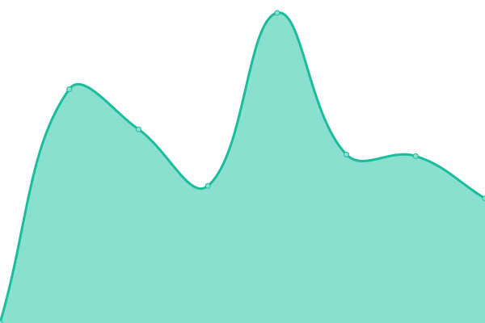
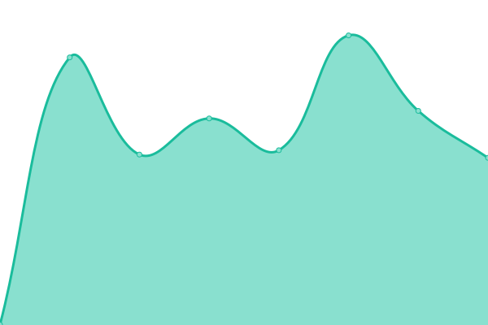

# [📈 Live Status](https://left024.github.io/upptime): <!--live status--> **所有系统都可以正常运行**

This repository contains the open-source uptime monitor and status page for [left024](https://left.pink), powered by [Upptime](https://github.com/upptime/upptime).

With [Upptime](https://upptime.js.org), you can get your own unlimited and free uptime monitor and status page, powered entirely by a GitHub repository. We use [Issues](https://github.com/left024/upptime/issues) as incident reports, [Actions](https://github.com/left024/upptime/actions) as uptime monitors, and [Pages](https://left024.github.io/upptime) for the status page.

<!--start: status pages-->
<!-- This summary is generated by Upptime (https://github.com/upptime/upptime) -->
<!-- Do not edit this manually, your changes will be overwritten -->
<!-- prettier-ignore -->
| 链接 | 状态 | 历史 | 响应时间 | 正常运行时间 |
| --- | ------ | ------- | ------------- | ------ |
|  [Blog](https://left.pink/) | 🟩 正常运行 | [blog.yml](https://github.com/Left024/upptime/commits/HEAD/history/blog.yml) | 

 687毫秒
     
 | 

<a href="https://uptime.left.pink/history/blog">100.00%</a>
    

|  [L-Clock Document](https://lclock.leftapp.pink/) | 🟩 正常运行 | [l-clock-document.yml](https://github.com/Left024/upptime/commits/HEAD/history/l-clock-document.yml) | 

 309毫秒
     
 | 

<a href="https://uptime.left.pink/history/l-clock-document">100.00%</a>
    

|  [Rsshub](https://rsshub.left.pink/) | 🟩 正常运行 | [rsshub.yml](https://github.com/Left024/upptime/commits/HEAD/history/rsshub.yml) | 

 523毫秒
     
 | 

<a href="https://uptime.left.pink/history/rsshub">99.80%</a>
    

|  [Chevereto](https://chevereto.left.pink/) | 🟩 正常运行 | [chevereto.yml](https://github.com/Left024/upptime/commits/HEAD/history/chevereto.yml) | 

 1099毫秒
     
 | 

<a href="https://uptime.left.pink/history/chevereto">99.80%</a>
    

|  Vaultwarden | 🟩 正常运行 | [vaultwarden.yml](https://github.com/Left024/upptime/commits/HEAD/history/vaultwarden.yml) | 

 509毫秒
     
 | 

<a href="https://uptime.left.pink/history/vaultwarden">99.81%</a>
    

|  Activation Service | 🟩 正常运行 | [activation-service.yml](https://github.com/Left024/upptime/commits/HEAD/history/activation-service.yml) | 

 238毫秒
     
 | 

<a href="https://uptime.left.pink/history/activation-service">100.00%</a>
    

|  Code Server A | 🟩 正常运行 | [code-server-a.yml](https://github.com/Left024/upptime/commits/HEAD/history/code-server-a.yml) | 

 215毫秒
     
 | 

<a href="https://uptime.left.pink/history/code-server-a">100.00%</a>
    

|  CloudPowerall | 🟩 正常运行 | [cloud-powerall.yml](https://github.com/Left024/upptime/commits/HEAD/history/cloud-powerall.yml) | 

 41毫秒
     
 | 

<a href="https://uptime.left.pink/history/cloud-powerall">100.00%</a>
    

|  Racknerd | 🟩 正常运行 | [racknerd.yml](https://github.com/Left024/upptime/commits/HEAD/history/racknerd.yml) | 

 43毫秒
     
 | 

<a href="https://uptime.left.pink/history/racknerd">100.00%</a>
    

|  QBittorrent | 🟩 正常运行 | [q-bittorrent.yml](https://github.com/Left024/upptime/commits/HEAD/history/q-bittorrent.yml) | 

 175毫秒
     
 | 

<a href="https://uptime.left.pink/history/q-bittorrent">100.00%</a>
    

|  Calibre | 🟩 正常运行 | [calibre.yml](https://github.com/Left024/upptime/commits/HEAD/history/calibre.yml) | 

 893毫秒
     
 | 

<a href="https://uptime.left.pink/history/calibre">99.81%</a>
    

|  [ttrss](https://ttrss.left.pink) | 🟩 正常运行 | [ttrss.yml](https://github.com/Left024/upptime/commits/HEAD/history/ttrss.yml) | 

 486毫秒
     
 | 

<a href="https://uptime.left.pink/history/ttrss">99.81%</a>
    

|  [mail](https://mail.leftapp.pink) | 🟩 正常运行 | [mail.yml](https://github.com/Left024/upptime/commits/HEAD/history/mail.yml) | 

 651毫秒
     
 | 

<a href="https://uptime.left.pink/history/mail">99.82%</a>
    

|  Code Server B | 🟩 正常运行 | [code-server-b.yml](https://github.com/Left024/upptime/commits/HEAD/history/code-server-b.yml) | 

 581毫秒
     
 | 

<a href="https://uptime.left.pink/history/code-server-b">100.00%</a>
    

<!--end: status pages-->

[**Visit our status website →**](https://left024.github.io/upptime)

## 📄 License

- Powered by: [Upptime](https://github.com/upptime/upptime)
- Code: [MIT](./LICENSE) © [left024](https://left.pink)
- Data in the `./history` directory: [Open Database License](https://opendatacommons.org/licenses/odbl/1-0/)
